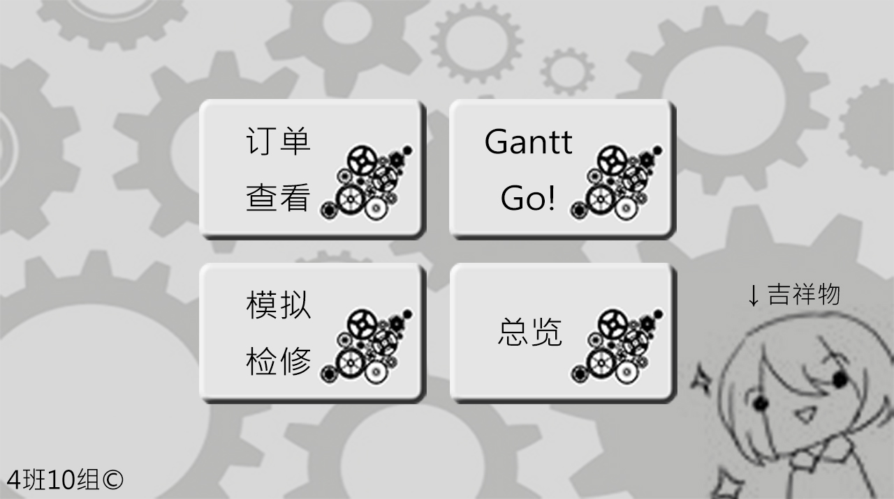
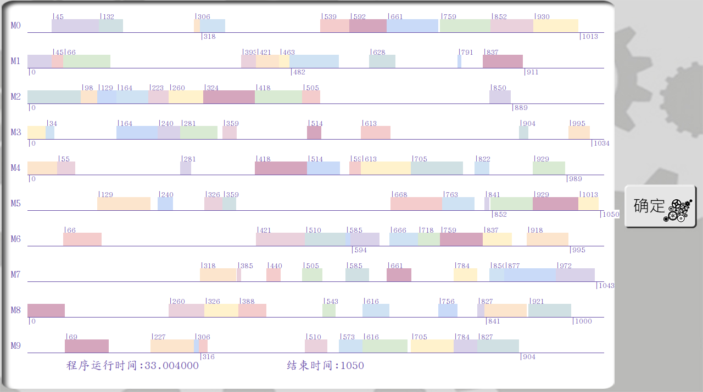

# A homework of bupt
Fisrt thing first-This project was finally finished at the middle of the June,2018 by @Seyuko ,THE-ONE-BROTHER and me. And without question, We got A+ in this course. I express my greatest gratitude to my partner especially Seyuko not only for supporting such a fantastic GUI, but also for the joyful teamwork about conquering this task.

And,**first thing.If you are also a freshman of bupt,please accomplish the task indpendently. :)**

## Specification
All the codes included GUI were contained in the folder jobshop_vs2012.If you just want to if it could be ran rightly or not you can just check GA_Jobshop.c in the root.
The reference contained the paper and the data we used.
The test_data contained, emmm, you know,the data for testing.

Actually,there is still a small bug ~~(actually,not bug,but a unfinished function.I am just lazt to finish it. XD)~~ that our teacher didn't discover it.Don't worry,it dosen't affect the algorithm to operate .

## Exhibition

